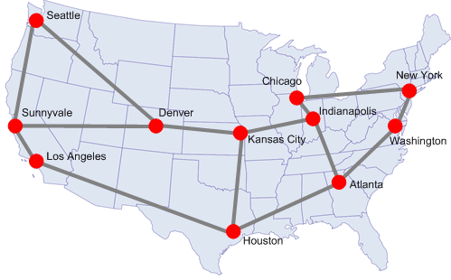

# Solutions semaine 2

## Open questions

### Question 1
Les adresses de maisons sont de types "hiérarchiques". Prenons une adresse comme par exemple "15 Rue des Wallons, Louvain-La-Neuve 1348 Belgique". On voit clairement, par ordre de précision "Belgique > 1348 > Louvain-La-Neuve > Rue des Wallons > n°15". Une telle adresse permet de trouver plus facilement l'endroit exact et permet de localiser une élément parmis un groupe d'éléments (rue, ville, village, pays, ...). 

Nous utilisons aussi des adresses "plates", comme par exemple: une numéro de compte bancaire IBAN 2165 8454 1234 5123 permet d'indiquer un numéro de compte précis et unique. Ce genre d'adresses est beaucoup plus simple à utiliser mais ne présente aucune informatisation de hiérarchisations. Il est impossible de relier deux numéros de compte en banque en fonction de la ville du propriétaire ou autre. 

### Question 2

  
  Les *forwarding tables* étant vides, celles-ci sont construites au fur et à mesure de l'échange des paquets. Trois échanges sont effectués ; analysons-les en détail :
  
  1. **C envoie un paquet à B**
    
    C commence par envoyer à R3 au Nord-Ouest. R3 n'a jamais reçu de paquet de C. Il ajoute donc une entrée à sa *forwarding table* indiquant que C peut être contacté par le Sud-Est :
    
    | R3 | Dest. | Port. |
    |----|-------|-------|
    |    | C     | SE    |
    
    R3 ne sachant pas comment joindre B, il *broadcast* dans chacun de ses ports, au Nord-Est et à l'Est.
    
    Considérons en premier lieu le Nord-Est. R3 envoie à R2 par le Nord-Est. R2 n'a jamais reçu de paquet en provenance de C. Il ajoute donc une entrée à sa *forwarding table* indiquant que C peut être contacté par le Sud-Ouest :
    
    | R2 | Dest. | Port. |
    |----|-------|-------|
    |    | C     | SW    |
    
    R2 ne sachant pas comment joindre B, il *broadcast* dans chacun de ses ports, ici uniquement à l'Ouest. R2 envoie donc à R1 par l'Ouest. R1 n'a jamais reçu de paquet en provenance de C. Il ajoute donc une entrée à sa *forwarding table* indiquant que C peut être contacté par l'Est :
    
    | R1 | Dest. | Port. |
    |----|-------|-------|
    |    | C     | E     |
    
    R1 ne sachant pas comment joindre B, il *broadcast* dans chacun de ses ports, ici uniquement à l'Ouest. R1 envoie donc à 1 par l'Ouest. A reçoit un message qui ne lui est pas destiné, et s'en débarasse.
    
    Retournons à R3. En même temps que R3 avait envoyé au Nord-Est à R2, R3 envoie à B par l'Est. B reçoit donc le paquet qui lui était destiné.
  
  2. **A envoie un paquet à C**
    
    A commence par envoyer un paquet à R1 à l'Est. R1 reçoit le paquet à destination de C. Au passage, celui-ci découvre qu'il peut contacter A par l'Ouest. Il met donc à jour sa *forwarding table* :
    
    | R1 | Dest. | Port. |
    |----|-------|-------|
    |    | A     | W     |
    |    | C     | E     |
    
    Ensuite, R1 regarde sa *forwarding table* et trouve que C est joignable par l'Est. Il envoie donc le paquet à R2. R2 le reçoit et découvre qu'il peut contacter A par l'Ouest. Il met donc à jour sa *forwarding table* :
    
    | R2 | Dest. | Port. |
    |----|-------|-------|
    |    | A     | W     |
    |    | C     | SW    |
    
    Ensuite, R2 regarde sa *forwarding table* et trouve que C est joignable par le Sud-Ouest. Il envoie donc le paquet à R3. R3 le reçoit et découvre qu'il peut contacter A par le Nord-Est. Il met donc à jour sa *forwarding table* :
    
    | R3 | Dest. | Port. |
    |----|-------|-------|
    |    | A     | NE    |
    |    | C     | SE    |
    
    Ensuite, R3 regarde sa *forwarding table* et trouve que C est joignable par le Sud-Est. Il envoie donc le paquet à C.
    
### Question 3

Comme on utilise toujours la méthode de "port-forwarding", on aura un problème de paquet qui tourne indéfiniement dans le réseau.

Par exemple, si C envoie un paquet à B, le paquet fera: 
- C -> R3
- R3 -> B 
- R3 -> R2
- R3 -> R1
- R1 -> A
- R1 -> R3
- et ainsi de suite

Une solution à ce problème serait l'utilisation de routage de vecteurs de distances(distance vector routing) ou de routage par état de lien (link state routing). 

### Question 4

Comme l'algorithme de routage permet de trouver le chemin de poids optimal (le plus petit), et qu'il peut y avoir des chemins de poids négatifs dans le graphe, il est possible que l'algorithme parvienne à trouver un cycle de poids négatifs. Après avoir trouvé ce cycle, l'algorithme chercherait à l'emprunter à l'infini, c'est à dire de boucler indéfiniment dans ce cycle afin de minimiser le chemin totale d'une manière tout-à-fait absurde.

### Question 5

LA - NY: Houston-Atlanta-Washingtown
LA - Washingtown: Houston-Atlanta

Pour éviter que l'itinéraire LA-NY passe par Houston et Atlanta, on peut changer le lien "Washingtown-NY" et lui mettre un poids de 3. Ainsi, le chemin de poids idéal passerait par "Sunnydale-Denver-Kansas City-Indianapolis-Chicago". 

Il est également possible de définir des poids tels que le chemin "Los Angeles-New York" et "New York-Los Angeles" passe par des chemins tout-à-fait différents. Mais pour faire ceci, il faut pouvoir définir des liens qui ne sont pas bidirectionnels et qui présentent un poids différent dans un sens et dans l'autre. 

Peut-on avoir un lien entre "Denver" et "Kansas City" tel qu'aucun autre intinéraire ne fasse transiter de paquets dans ce chemin? Non car il faudrait que ce lien ait un poids inférieur à 4 sinon les paquets entre "Denver" et "Kansas City" transiteraient par un lien indirect via "Sunnydale LosAngeles Houston". Or, si le poids est inférieur à 4, les paquets entre "Seatle" et "Kansas City" transiterons par "Denver".  
